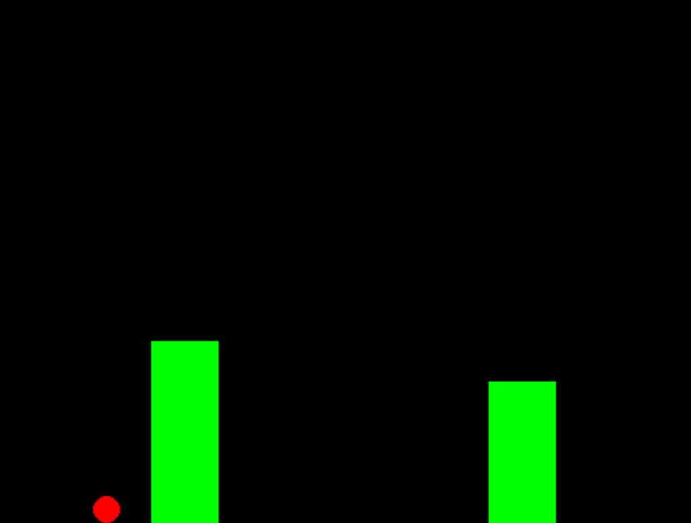

# CISC851-Group-Project
Dinosaur Game is a digital game where users control a T-rex using keyboards to maximize their scores by avoiding obstacles.  [Jump Game](https://github.com/Suji04/jumpingameAI) is a simplified version of Dinosaur Game. It replaces T-rex with a circle and the obstacle with a rectangle. 

Our project has implemented a Neuroevolution algorithm, which combines Neural Network (NN) with Genetic Algorithm, to find an optimized NN model that can guide users towards higher scores in the jump game.

It includes the following essential scripts:
 - *nn.py*: A 3-layer Neural Network model (input layer: 5 nodes, hidden layer: 8 nodes, output layer: 2 nodes)
 - *ea.py*: Evolutionary Algorithm to optimize weights for NN
 - *fitness.py*: Fitness calculation. It calculates the fitness as the distance that an individual Neural Network model traveled in a given landscape
 - *mutation.py*: Uncorrelated mutation with one-step size and n-step size
 - *parent_selection.py*: Multiple parent selection algorithms, including MPS, tournament and topK. 
 - *survival_selection.py*: Multiple survival selection algorithms, including $\mu$ plus $\lambda$ and replacement.

Additionally, *visualization.py* can create GUI for playing the game. *test.py* can create combinations of test scenarios based on parameters set in *constants.py*. Generated test cases are stored under *test* folder. After running test cases under the *test* folder, testing results are stored in https://github.com/mincocoder/CISC_results, and they are evaluated by *evaluation.py*. The generated plots are stored under *results* folder.

To run the project, please follow the instructions in the later sections.

## Environment Setup
Choose the correct python Interpreter version to run the program in VScode:
* python 3.8.7
* pygame installation:
```bash
python3 -m pip install -U pygame --user

## Check if it works:
python3 -m pygame.examples.aliens
```

## Test Generation 
To generate the first set of test cases, we can provide a numeric value \(e.g. 5\) that will be appended to the test folder's name. 
Run the following command:
```bash
python3 test.py 5
```
The generated test cases under *test* folder looks like this:
```
├── test
│   ├── test5
│       ├── test_1
│           ├── 1
│               ├── input_params.json
│               ├── ea.py
│               ├── ...
│           ├── 2
│           ├── ...
│           ├── 32
│       ├── test_2
│       ├── ...
│       ├── test_20
│       ├── hyper_parameters.json
```
The folder structure indicates that this set of test cases will be run 20 times, and each iteration has 32 different combinations of set parameters. 

## Test Running
Each test case can be run independently in each folder under *test*. Take the test case in the `test5/test_1/20` folder as an example, running *ea.py* in the folder can trigger the individual test:
```

```

## Evaluation
Test results can be evaluated by running *evaluation.py*. Our current results are stored as a compressed file named `test5_epoch_60.tar.gz`, and decompression is required: `tar -xvf test5_epoch_60.tar.gz`.

Once the folder `test5_epoch_60` is retrieved, run the following commands: 
```
python3 evaluation.py test5_epoch_60
```

## Visualization
We provide options of visualizing the game by running *visualization.py* in the *test* folder. There is a *visualization.py* script under each generated test case folders. For example, we can run the command to visualize the game after training under test case `test5/test_1/20` as below:
```bash
cd test
python3 test5/test_1/20/visualization.py 
```
GUI looks like: 


